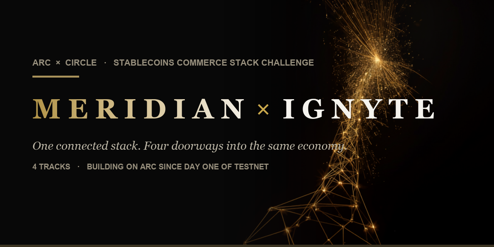
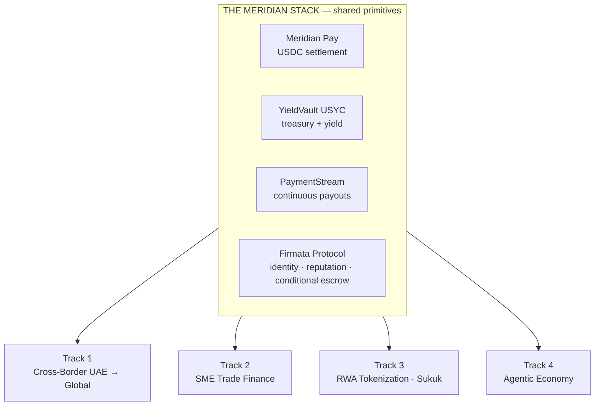

<!-- ⚠️ DRAFT PRIVÉ — reste privé jusqu'à la submission Ignyte (~10-13 juillet). Flip public au moment de soumettre. Ne pas pousser public avant. -->

<div align="center">



<br/><br/>

# Meridian — The USDC-EURC Commerce OS on Arc

**One connected stack. Four doorways into the same economy.**

*Submitted to the Ignyte × Arc Stablecoins Commerce Stack Challenge.*
*For educational and testnet demo purposes only.*

</div>

---

Most hackathon entries are a product. This is an operating system.

Meridian has been building on Arc since day one of Testnet (October 28, 2025): 19 contracts live, 47,800+ on-chain transactions, USYC Teller whitelist granted, 20 Circle products in production. For this challenge we did not build four separate apps. We took the primitives we already run in production and showed how the **same connected stack** answers four very different regional needs.

That is the whole point: **not stacked products, connected ones.** A merchant accepts USDC & EURC, the treasury earns on it, payroll streams out of it, an agent transacts against it, and every counterparty is verified by the same trust layer. Change the doorway, the engine stays the same.



## The four submissions

| Track | What we demonstrate | Core Meridian engine | Circle products | Folder |
|---|---|---|---|---|
| **4 — Agentic Economy** | An AI agent that discovers, negotiates and settles a USDC-EURC purchase, with every counterparty verified on-chain (KYA) | Firmata + Agent OS | USDC-EURC · Wallets · Nanopayments · Gateway | [`/track-4-agentic`](./track-4-agentic) |
| **1 — Cross-Border UAE→Global** | Instant low-cost remittance + freelancer/payroll payouts, AED-in / USDC-settle, transparent fees and receipts | Pay + Wallets + CCTP | USDC-EURC · Wallets · Gateway · CCTP · StableFX* | [`/track-1-crossborder`](./track-1-crossborder) |
| **2 — SME Trade Finance** | Milestone-based escrow for import/export + an SME "credit passport" built from verifiable on-chain history | Firmata escrow (ERC-8183) + reputation | USDC-EURC · Wallets · Gateway · USYC* | [`/track-2-trade`](./track-2-trade) |
| **3 — RWA Tokenization (Sukuk)** | Fractional Sukuk with embedded Sharia + compliance logic, programmable profit distribution, investor checks | Vault USYC + tokenization | USDC-EURC · Wallets · USYC* | [`/track-3-rwa`](./track-3-rwa) |

\* USYC and StableFX are Circle Enterprise / gated tools. Where testnet access is pending, the integration is shown at architecture and conceptual level, per the challenge rules.

## Built on production, not built for the demo

- **19 contracts** live on Arc Testnet (chain id 5042002), verifiable on [testnet.arcscan.app](https://testnet.arcscan.app)
- **47,800+** on-chain transactions across the stack
- Building since **day one of Testnet**, October 28, 2025
- **USYC Teller whitelist** granted
- Broader ecosystem index: [github.com/MeridianFinance/meridian-ecosystem](https://github.com/MeridianFinance/meridian-ecosystem)

The MVPs in this repo are clean demonstration builds. The production protocol source stays private; the demos call our already-deployed contracts and show our Circle integration end to end.

## Repo structure

```
meridian-ignyte/
├── README.md                 ← you are here (the connected-stack story)
├── track-1-crossborder/      ← MVP + setup + Circle integration docs + diagram
├── track-2-trade/
├── track-3-rwa/
├── track-4-agentic/
└── docs/
    ├── architecture/         ← per-track architecture diagrams
    └── circle-feedback.md    ← Circle Product Feedback (shared + per-track)
```

Each track folder is a self-contained, runnable submission with its own README, setup instructions, and Circle-integration documentation.

## Circle Developer Account

Email: `abdelmouss63@gmail.com`

## Team

**Meridian Finance Group** — Abdelaziz (CEO) & Fayssal (CTO). Local Leaders, Arc France/Europe chapter. Building the financial OS for USDC-EURC commerce on Arc.

[themeridian.finance](https://themeridian.finance) · [firmata.ai](https://firmata.ai) · [arcagent.live](https://arcagent.live)
