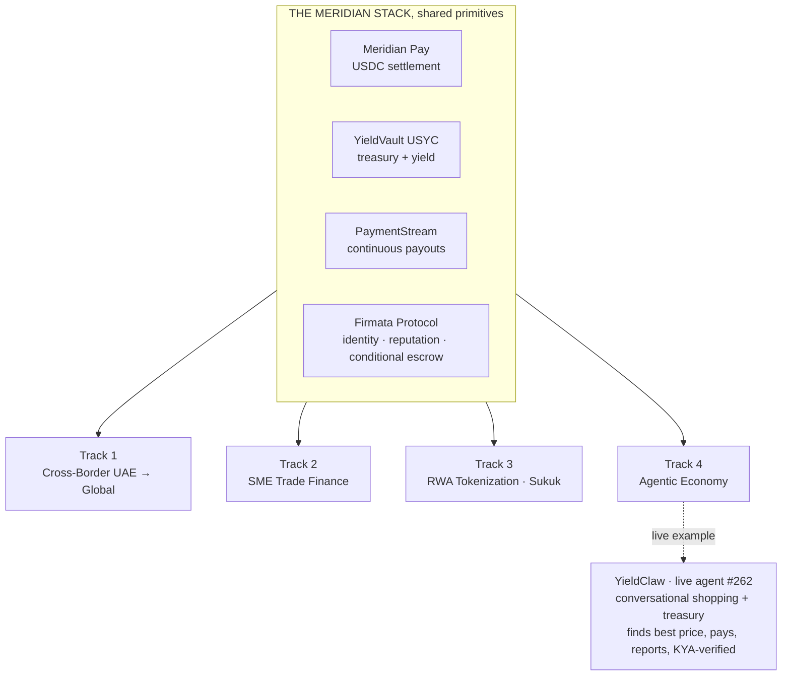

<div align="center">


<br/><br/>

# Meridian: The USDC-EURC Commerce OS on Arc

**One connected stack. Four doorways into the same economy.**

*Submitted to the Ignyte × Arc Stablecoins Commerce Stack Challenge.*
*For educational and testnet demo purposes only.*

</div>

---

Most hackathon entries are a product. This is an operating system.

Meridian has been building on Arc since day one of Testnet (October 28, 2025): 19 contracts live, 47,800+ on-chain transactions, USYC Teller whitelist granted, 20 Circle products in production. For this challenge we did not build four separate apps. We took the primitives we already run in production and showed how the **same connected stack** answers four very different regional needs.

That is the whole point: **not stacked products, connected ones.** A merchant accepts USDC & EURC, the treasury earns on it, payroll streams out of it, an agent transacts against it, and every counterparty is verified by the same trust layer. Change the doorway, the engine stays the same.



## The four submissions

| Track | What we demonstrate | Core Meridian engine | Circle products | Folder |
|---|---|---|---|---|
| **4, Agentic Economy** | **YieldClaw** (live agent #262): talk to it in plain language, it checks your balance, finds the best price across merchants, pays in USDC-EURC with zero gas, reports back, and verifies every counterparty via Firmata (KYA). Also runs treasury autonomously. | Firmata + Agent OS + YieldClaw | USDC-EURC · Wallets · Nanopayments · Gateway | [`/track-4-agentic`](./track-4-agentic) |
| **1, Cross-Border UAE→Global** | Instant low-cost remittance + freelancer/payroll payouts, AED-in / USDC-settle, transparent fees and receipts | Pay + Wallets + CCTP | USDC-EURC · Wallets · Gateway · CCTP · StableFX* | [`/track-1-crossborder`](./track-1-crossborder) |
| **2, SME Trade Finance** | Milestone-based escrow for import/export + an SME "credit passport" built from verifiable on-chain history | Firmata escrow (ERC-8183) + reputation | USDC-EURC · Wallets · Gateway · USYC* | [`/track-2-trade`](./track-2-trade) |
| **3, RWA Tokenization (Sukuk)** | Fractional Sukuk with embedded Sharia + compliance logic, programmable profit distribution, investor checks | Vault USYC + tokenization | USDC-EURC · Wallets · USYC* | [`/track-3-rwa`](./track-3-rwa) |

\* USYC and StableFX are Circle Enterprise / gated tools. Where testnet access is pending, the integration is shown at architecture and conceptual level, per the challenge rules.

## See it running

Two surfaces are already public: the trust layer at firmata.ai and the live agent activity feed at arcagent.live. Our main product app (payments, agent, vault) is in private access for now, open to the Circle and Arc team we are working with, with a new version moving from dev to production. The videos below show those flows end to end, and every contract is public and verifiable on Arcscan.

- **Trust layer (live):** https://firmata.ai
- **Agent activity feed (live):** https://arcagent.live
- **Overview walkthrough (video):** https://youtu.be/b7Ww4dd5ntU
- **Passkey login and USYC vault deposit (video):** https://youtu.be/9gvkIriycQU
- **Meridian Pay checkout (video):** https://youtu.be/mtd9dHMEdLk
- **Everything verifiable on-chain:** https://testnet.arcscan.app

## Built on production, not built for the demo

- **19 contracts** live on Arc Testnet (chain id 5042002), verifiable on [testnet.arcscan.app](https://testnet.arcscan.app)
- **47,800+** on-chain transactions across the stack
- Building since **day one of Testnet**, October 28, 2025
- **USYC Teller whitelist** granted
- Broader ecosystem index: [github.com/MeridianFinance/meridian-ecosystem](https://github.com/MeridianFinance/meridian-ecosystem)

The MVPs in this repo are clean demonstration builds. The production protocol source stays private; the demos call our already-deployed contracts and show our Circle integration end to end.

## Contracts on Arc Testnet, all verifiable

Every contract below is live on Arc Testnet (chain 5042002) and public on Arcscan. Click any address to verify it. These are the core contracts behind the four tracks; the full stack runs 19 contracts on Arc.

**Treasury and RWA (Track 3)**

| Contract | Address |
|---|---|
| YieldVault V3, retail | [`0x2f685b5Ef138Ac54F4CB1155A9C5922c5A58eD25`](https://testnet.arcscan.app/address/0x2f685b5Ef138Ac54F4CB1155A9C5922c5A58eD25) |
| Enterprise USYC Vault | [`0xdae34fcc36d0772f6e04674971f798fa01bd0538`](https://testnet.arcscan.app/address/0xdae34fcc36d0772f6e04674971f798fa01bd0538) |
| USYC Timelock, 24h governance | [`0x9f3856dF5CE0797aEe7FaE3E13794d4d52f9eB40`](https://testnet.arcscan.app/address/0x9f3856dF5CE0797aEe7FaE3E13794d4d52f9eB40) |

**Payments and cross-border (Track 1)**

| Contract | Address |
|---|---|
| PaymentStream V3 | [`0x1fcb750413067Ba96Ea80B018b304226AB7365C6`](https://testnet.arcscan.app/address/0x1fcb750413067Ba96Ea80B018b304226AB7365C6) |
| GatewayReceiver, CCTP V2 + Circle Gateway | [`0x8B412f7cAfA72482BE146268C4AD57231D8282cF`](https://testnet.arcscan.app/address/0x8B412f7cAfA72482BE146268C4AD57231D8282cF) |
| x402 Receiver, HTTP nanopayments | [`0x68ebe8f653f7a99cd8590f212818d2b60fdb3cac`](https://testnet.arcscan.app/address/0x68ebe8f653f7a99cd8590f212818d2b60fdb3cac) |

**Trust and agents (Tracks 2 and 4), Firmata Protocol**

| Contract | Address |
|---|---|
| IdentityRegistry, ERC-8004 | [`0x8004A818BFB912233c491871b3d84c89A494BD9e`](https://testnet.arcscan.app/address/0x8004A818BFB912233c491871b3d84c89A494BD9e) |
| ReputationRegistry, ERC-8004 | [`0x8004B663056A597Dffe9eCcC1965A193B7388713`](https://testnet.arcscan.app/address/0x8004B663056A597Dffe9eCcC1965A193B7388713) |
| ValidationRegistry, ERC-8004 | [`0x8004Cb1BF31DAf7788923b405b754f57acEB4272`](https://testnet.arcscan.app/address/0x8004Cb1BF31DAf7788923b405b754f57acEB4272) |
| FirmataCommerce, ERC-8183 | [`0xc91ab8c8c9d1879357e1c8cd60a936643f447417`](https://testnet.arcscan.app/address/0xc91ab8c8c9d1879357e1c8cd60a936643f447417) |
| FirmataEvaluatorV2 | [`0x0e55949531ba5bacbfa45c186cdcb9811d23c978`](https://testnet.arcscan.app/address/0x0e55949531ba5bacbfa45c186cdcb9811d23c978) |
| FirmataSLAHook | [`0x99c539ec88851980f05d42c90b18f122f1c01dad`](https://testnet.arcscan.app/address/0x99c539ec88851980f05d42c90b18f122f1c01dad) |
| FirmataReputationV2 | [`0xacb1f85bce0731d2bcb0e0788c88e45eba7a72ad`](https://testnet.arcscan.app/address/0xacb1f85bce0731d2bcb0e0788c88e45eba7a72ad) |
| FirmataSLA | [`0x8b1fb35f25c799aa4dc8460f83b4b7a86f0f7854`](https://testnet.arcscan.app/address/0x8b1fb35f25c799aa4dc8460f83b4b7a86f0f7854) |
| FirmataUsageLog | [`0x4bf87626da383230eb663988e45975f3e9772003`](https://testnet.arcscan.app/address/0x4bf87626da383230eb663988e45975f3e9772003) |
| MeridianProof, cross-chain agent identity (SBT) | [`0x7ED960c5437007C63Ea954BB01BBd36396F46490`](https://testnet.arcscan.app/address/0x7ED960c5437007C63Ea954BB01BBd36396F46490) |

## Beyond the four tracks: the full ecosystem

The four submissions above are slices of a larger stack we already run. We are not naming these as track entries (they fall outside this challenge's scope), but judges asked to see who we really are, so here is the rest of the picture.

- **Enterprise Circle tools, in production, not conceptual.** USYC (Teller whitelist) and StableFX have been live in our stack since 2025. The challenge rules note that most teams will only be able to integrate these gated tools at a conceptual level. We operate with real access already, which is why our RWA and FX flows are demonstrated with the actual products rather than mockups.
- **Meridian Give**, a charitable-giving layer: merchant round-up at checkout and on-chain donation proofs. It is not a commerce/finance/agentic track, so it is not submitted here, but it is part of the same connected OS and shows the breadth of what the stack powers.
- **cirBTC support**, we integrate Circle's tokenized BTC alongside stablecoins, broadening treasury and collateral options. Out of scope for a stablecoin commerce challenge, included here only to show Circle-product breadth.
- **20 Circle products** integrated across the stack in production. The four tracks use a focused subset; the full ecosystem reaches much further.

This is a working ecosystem with eight months of on-chain history, not a hackathon-weekend prototype. The four tracks are where it meets this challenge's themes.

## Repo structure

```
meridian-ignyte/
├── README.md                 ← you are here (the connected-stack story)
├── track-1-crossborder/      ← README, live demo, architecture diagram, Circle integration
├── track-2-trade/
├── track-3-rwa/
├── track-4-agentic/
└── docs/
    └── circle-feedback.md    ← Circle Product Feedback across the stack
```

Each track folder is a self-contained submission: its own README, the live demo, an architecture diagram, and the Circle integration.

## Circle Developer Account

Email: `abdelmouss63@gmail.com`

## Team

**Meridian Finance Group**, Abdelaziz (CEO) & Fayssal (CTO). Local Leaders, Arc France/Europe chapter. Building the financial OS for USDC-EURC commerce on Arc.

[themeridian.finance](https://themeridian.finance) · [firmata.ai](https://firmata.ai) · [arcagent.live](https://arcagent.live)
