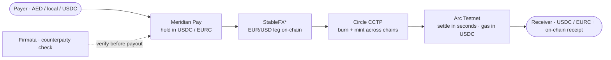

# Track 1 · Cross-Border Payments, UAE to Global

**Send value across borders and have it land in seconds, in USDC or EURC, with the fee shown up front and the receipt verifiable on-chain.**

*Part of [Meridian × Ignyte](../README.md). For educational and testnet demo purposes only.*

**Demo:** the checkout video below. The live page is in private access for now, open to the Circle and Arc team.
**Track:** 1, Cross-Border UAE to Global
**Circle products used:** USDC · EURC · Circle Wallets · CCTP · Gateway · StableFX\*

---

## The problem

Cross-border payment is still one of the most expensive and opaque things a person or a small business does. The World Bank puts the global average cost of sending a small remittance at 6.36 percent of the amount (Remittance Prices Worldwide, Q3 2025), and a normal bank transfer takes one to five working days as it hops through correspondent banks, each adding its own fee, cutoff time and cut of the exchange rate. The sender rarely sees the real cost, and the receiver cannot check where the money is.

The UAE is one of the largest remittance-sending markets in the world. Millions of workers send money home, thousands of SMEs pay suppliers and freelancers abroad, and every one of those flows pays the correspondent-bank tax and waits on the correspondent-bank clock. This is the corridor Track 1 targets, and it is a corridor where a stablecoin rail is not a nice-to-have, it is a step change.

## What we run

Meridian Pay is our settlement layer, live on Arc. Cross-border is not a new product for us, it is the same settlement engine pointed at a route that crosses a border and, often, a currency:

1. Value comes in, in local currency or in a stablecoin, and is held as USDC or EURC.
2. If the two sides need different currencies, the euro to dollar leg goes through StableFX with an on-chain settlement, so there is no bilateral FX desk and no hidden spread.
3. The stablecoin moves between chains through Circle CCTP, burned on the source chain and minted on the destination by Circle itself, with no third-party bridge in the path.
4. It lands with the receiver in seconds on Arc, gas paid in USDC, and it leaves a receipt anyone can verify on testnet.arcscan.app.

The fee is shown before the transfer, not discovered after. The receipt is on-chain, not a line on a statement the receiver has to trust. The whole thing settles at machine speed, day or night, weekend or holiday, because there is no interbank clearing window to wait for.

## Why it fits Track 1

The track asks for low-cost, transparent cross-border settlement. We are not proposing it, we run the settlement engine in production. The remittance, the supplier payment and the freelancer or payroll payout are the same Meridian Pay flow aimed at a UAE to global route, settled in Circle stablecoins, with the fee and the receipt exposed instead of hidden.

## How it works

## How we integrate Circle, product by product

- **USDC and EURC** carry the value from end to end. The corridor never touches a volatile asset, so the amount that leaves is the amount that arrives, minus a fee that is visible up front. Having both a regulated dollar and a regulated euro from the same issuer means a European SME can price in euro and settle a UAE supplier in dollar inside one trust model.
- **CCTP** moves the stablecoin between chains natively, burned on one side and minted on the other by Circle. This removes the bridge risk that has cost the industry billions, and it is what lets a payment start on one chain and finish where the receiver actually holds funds.
- **StableFX** handles the euro to dollar conversion on-chain with transparent pricing and escrow, so the FX leg settles both sides together or not at all (testnet access).
- **Gateway** provides the backend liquidity and routing so the user-facing flow stays a single action while the plumbing happens underneath.
- **Circle Wallets** custody the sender and receiver accounts and let a business pay without exposing a seed phrase.
- **Gas paid in USDC on Arc** keeps the cost dollar-denominated and predictable, which matters when the whole pitch is that the receiver knows exactly what lands.

## What makes it defensible

Moving a token is the easy part. The hard part of cross-border is trust and compliance at the two ends, the on-ramp and the off-ramp. Every counterparty in a Meridian flow can be checked through Firmata, identity and reputation recorded on-chain, before a payout is released. Every transfer leaves a receipt that the receiver, an auditor or a regulator can verify independently. That is the difference between a cheap transfer and one a business can put in its books and defend later.

## The numbers

- 19 contracts live on Arc Testnet (chain 5042002), verifiable on [testnet.arcscan.app](https://testnet.arcscan.app)
- 47,800+ on-chain transactions across the Meridian stack
- Building since day one of Testnet, October 28, 2025
- USDC represented roughly 70 percent of adjusted stablecoin transaction volume in H1 2026 (Visa on-chain data via CoinDesk), which is the settlement asset this corridor runs on

## What is next

The stablecoin leg is instant today. The next work is the edges: fiat on-ramp and off-ramp partners per corridor so a UAE sender can start in AED and a receiver can cash out locally, and a payroll mode aligned with regional wage-protection requirements for companies paying cross-border teams. The engine does not change, we extend the doorways.

## Proof it is live

**Watch a payment settle through the Meridian Pay checkout:** https://youtu.be/mtd9dHMEdLk

Payment flows run on Meridian's deployed contracts on Arc Testnet (chain 5042002), addresses public on [testnet.arcscan.app](https://testnet.arcscan.app). The live checkout page is in private access for now, open to the Circle and Arc team, with a new version moving from dev to production. The video shows the flow end to end.

## Run it

The flow is shown in the checkout video above. The production protocol source stays private. The demo calls our already-deployed contracts on Arc and shows the Circle integration end to end.

## Circle product feedback

See [`../docs/circle-feedback.md`](../docs/circle-feedback.md) for our notes on USDC, EURC, CCTP, StableFX, Gateway and Wallets in production.
