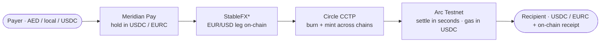

# Track 1 · Cross-Border Payments, UAE to Global

**Send value across borders and have it land in seconds, in USDC or EURC, with the fee and the receipt visible on-chain.**

*Part of [Meridian × Ignyte](../README.md). For educational and testnet demo purposes only.*

**Live demo:** https://pay.themeridian.finance (Meridian Pay, AI checkout)
**Track:** 1, Cross-Border UAE to Global
**Circle products used:** USDC · EURC · Circle Wallets · CCTP · Gateway · StableFX\*

---

## The problem

A worker in the UAE sending money home, or a company paying a freelancer in another country, still waits days and pays fees hidden inside a bad exchange rate. Nobody can see where the money is or what it really cost.

## What we run

Meridian Pay is our settlement layer, live on Arc. For a cross-border corridor the flow is the same primitive pointed at a different route:

1. Value comes in (local currency or stablecoin) and is held as USDC or EURC.
2. If the two sides need different currencies, the EUR/USD leg goes through StableFX with an on-chain settlement, no bilateral FX desk.
3. The stablecoin moves between chains through Circle CCTP, burned on the source chain and minted on the destination by Circle itself, with no third-party bridge.
4. It lands with the recipient in seconds on Arc, gas paid in USDC, and leaves a receipt anyone can verify on testnet.arcscan.app.

The fee is shown before the transfer, not discovered after. The receipt is on-chain, not a line on a statement the recipient cannot check.

## Why it fits Track 1

The track asks for low-cost, transparent cross-border settlement. We are not proposing it, we run the settlement engine in production. The remittance and the freelancer or payroll payout are the same Meridian Pay flow, aimed at a UAE to global route, settled in Circle stablecoins.

## How it works

## How we integrate Circle tools

- **USDC and EURC** carry the value end to end, so the corridor never touches a volatile asset.
- **CCTP** moves the stablecoin between chains natively, which removes the bridge risk that has cost the industry dearly.
- **StableFX** handles the euro to dollar conversion on-chain with transparent pricing (testnet access).
- **Gateway** provides the backend liquidity and routing behind the payment.
- **Circle Wallets** hold keys safely so a sender can pay without exposing a seed phrase.
- **Gas paid in USDC on Arc** keeps the cost predictable and dollar-denominated.

## What makes it defensible

Moving a token is the easy part. The hard part of cross-border is trust and compliance at the two ends. Every counterparty in a Meridian flow can be checked through Firmata (identity and reputation on-chain), and every transfer leaves a verifiable receipt. That is the difference between a cheap transfer and one a business can put in its books.

## Proof it is live

Deposit and payment flows run on Meridian's deployed contracts on Arc Testnet (chain 5042002), addresses public on [testnet.arcscan.app](https://testnet.arcscan.app). 19 contracts live, 47,800+ transactions since day one of Testnet, October 28, 2025.

## Run it

The demo is live at the URL above, no local setup needed to see it work. The production protocol source stays private. The demo calls our already-deployed contracts and shows the Circle integration end to end.

## Circle product feedback

See [`../docs/circle-feedback.md`](../docs/circle-feedback.md) for our notes on USDC, EURC, CCTP, StableFX, Gateway and Wallets in production.
