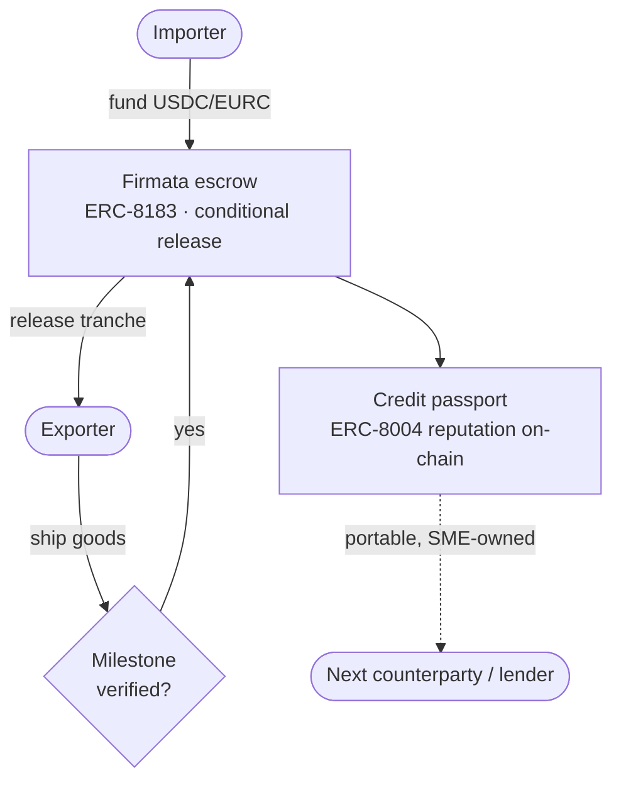
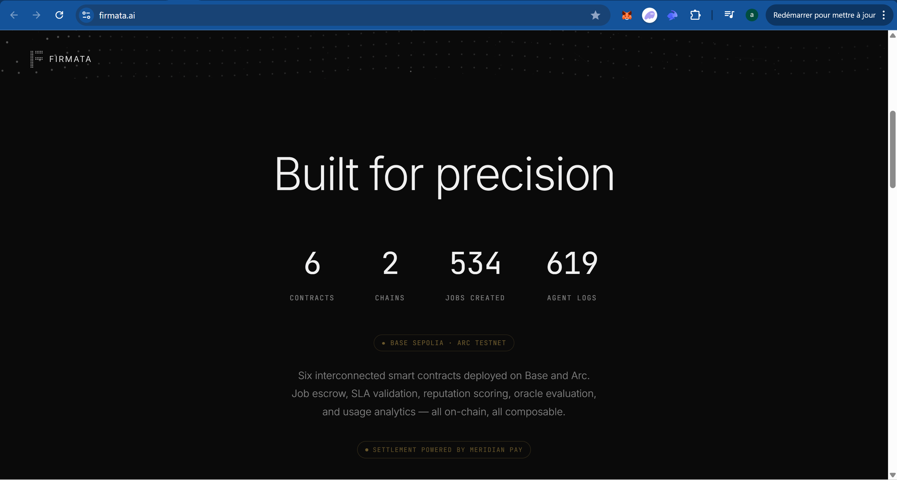
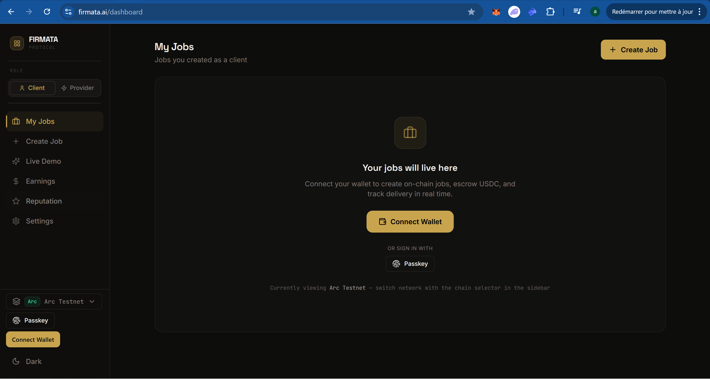
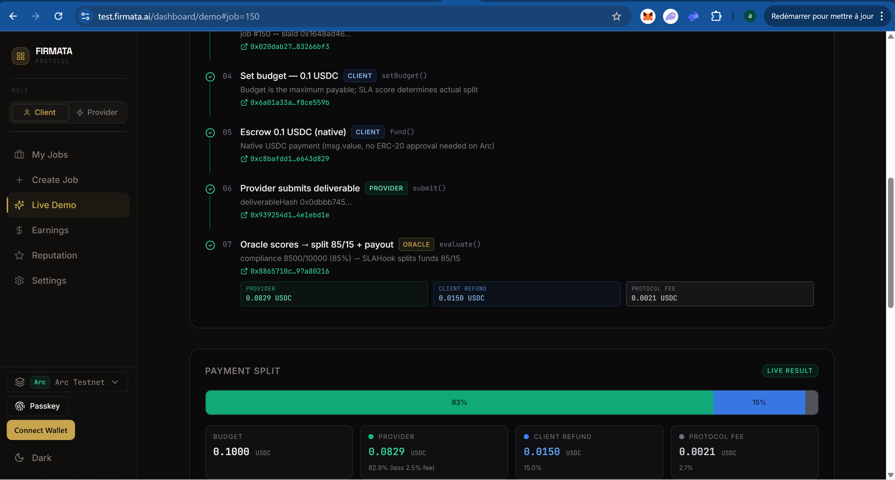
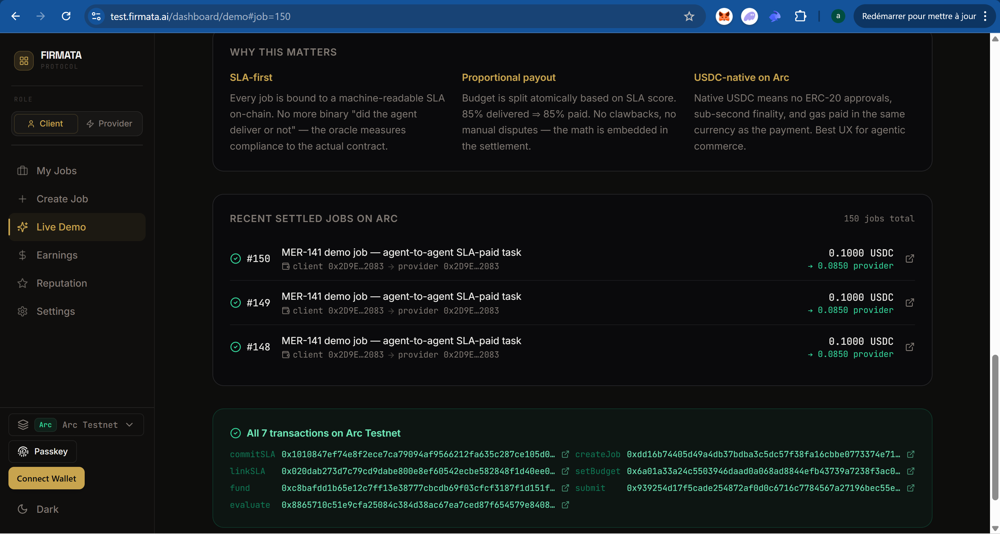

# Track 2 · SME Trade Finance

**Hold the money in a conditional escrow that releases on verified milestones, and let the SME build a credit history it actually owns.**

*Part of [Meridian × Ignyte](../README.md). For educational and testnet demo purposes only.*

**Live trust layer:** https://firmata.ai
**Demo:** the Firmata screenshots below. The settlement and merchant surfaces are in private access for now, open to the Circle and Arc team.
**Track:** 2, SME Trade Finance
**Circle products used:** USDC · EURC · Circle Wallets · Gateway · USYC\*

---

## The problem

An importer and an exporter who have never worked together are stuck in a standoff. The importer does not want to pay before the goods ship. The exporter does not want to ship before the money is there. Traditional trade finance solves this with letters of credit that are slow, paper-heavy, and out of reach for most small businesses. And when the deal is done, the track record stays locked inside one bank instead of belonging to the SME.

## What we run

Two Meridian primitives cover both halves:

**Conditional escrow (Firmata, ERC-8183).** Funds are locked in USDC or EURC and released in stages as each milestone is confirmed. Payment on shipment, payment on delivery, or a schedule agreed by both sides. Neither party has to trust the other, they trust the contract.

**Credit passport (Firmata reputation, ERC-8004).** Every completed contract, on-time delivery and repayment writes to an on-chain reputation record. Over time the SME carries a portable, verifiable credit history across counterparties, one it owns rather than rents from a lender.

## Why it fits Track 2

The track is SME trade finance. Milestone escrow plus a portable credit record is the core of it. Firmata is live, and the escrow and reputation are public standards we implement (ERC-8183 for commerce and escrow, ERC-8004 for identity and reputation). Settlement runs on Meridian Pay in Circle stablecoins.

## How it works

## How we integrate Circle tools

- **USDC and EURC** are the escrowed value, so the amount held is stable through the life of the contract.
- **Circle Wallets** custody the escrowed funds and the parties' accounts.
- **Gateway** routes settlement when a tranche releases.
- **USYC** lets idle escrow float earn short-term Treasury yield while it waits (enterprise access, held by Meridian).

## What makes it defensible

A credit score locked inside one lender helps that lender, not the business. A reputation the SME owns on-chain travels with it to the next supplier, the next buyer, the next line of credit. Combine that with escrow that removes counterparty risk from the deal itself, and a small exporter can trade with a partner across the world on terms that used to need a bank in the middle.

## Proof it is live

Firmata runs on Arc and Base. Meridian's contracts are live on Arc Testnet (chain 5042002), addresses public on [testnet.arcscan.app](https://testnet.arcscan.app). The escrow and reputation are referenced at the standard level; internal evaluator logic stays private.

## Circle product feedback

See [`../docs/circle-feedback.md`](../docs/circle-feedback.md).
