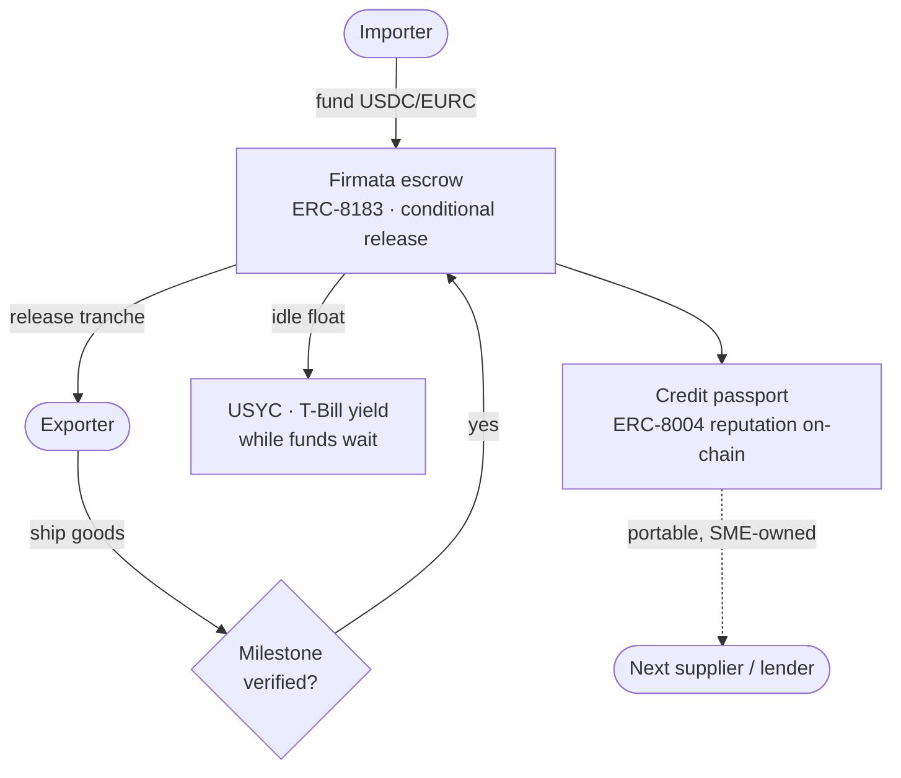

# Track 2 · SME Trade Finance

**Hold the money in a conditional escrow that releases on verified milestones, and let the small business build a credit history it actually owns.**

*Part of [Meridian × Ignyte](../README.md). For educational and testnet demo purposes only.*

**Live trust layer:** https://firmata.ai
**Demo:** the Firmata screenshots below. The settlement and merchant surfaces are in private access for now, open to the Circle and Arc team.
**Track:** 2, SME Trade Finance
**Circle products used:** USDC · EURC · Circle Wallets · Gateway · USYC\*

---

## The problem

An importer and an exporter who have never worked together are stuck in a standoff. The importer does not want to pay before the goods ship. The exporter does not want to ship before the money is there. The classic answer is a letter of credit, but it is slow, paper-heavy, and priced for large corporates, so most small businesses cannot get one. The Asian Development Bank puts the global trade finance gap in the trillions of dollars, and small and mid-sized businesses absorb most of it. When a deal does close, the track record that proves the SME is reliable stays locked inside one bank, useless to the next supplier or lender.

Two problems, then: no cheap way to remove counterparty risk from a single deal, and no way for the SME to carry its reputation from one relationship to the next.

## What we run

Two Meridian primitives cover both halves, and both are built on Firmata, our trust layer, which is live at firmata.ai.

**Conditional escrow (Firmata, ERC-8183).** Funds are locked in USDC or EURC and released in tranches as each milestone is confirmed: payment on shipment, payment on delivery, or any schedule the two sides agree. Neither party has to trust the other, they trust the contract. The escrow settles both sides together, which removes the uncomfortable moment where one party has paid and the other has not yet delivered.

**Credit passport (Firmata reputation, ERC-8004).** Every completed contract, on-time delivery and clean repayment writes to an on-chain reputation record. Over time the SME carries a portable, verifiable credit history across counterparties, one it owns rather than rents from a lender. A new supplier, or a financier deciding whether to fund the next shipment, can read that history directly instead of asking a bank that will not share it.

## Why it fits Track 2

The track is SME trade finance. Milestone escrow plus a portable credit record is the core of it. Firmata is live, and the escrow and reputation are public standards we implement: ERC-8183 for commerce and escrow, ERC-8004 for identity and reputation. Settlement runs on Meridian Pay in Circle stablecoins, and idle escrow float can earn yield through USYC while it waits.

## How it works

## How we integrate Circle, product by product

- **USDC and EURC** are the escrowed value, so the amount held stays stable through the whole life of the contract, which can run weeks or months. A euro importer and a dollar exporter can each work in their own currency.
- **Circle Wallets** custody the escrowed funds and the two parties' accounts, so a small business can take part without running key infrastructure.
- **Gateway** routes settlement the moment a tranche releases.
- **USYC** lets the escrowed float earn short-term US Treasury yield while it waits between milestones, held under our Teller whitelist. Money that would otherwise sit idle in escrow works for the duration.

## What makes it defensible

A credit score locked inside one lender helps that lender, not the business. A reputation the SME owns on-chain travels with it to the next supplier, the next buyer, the next line of credit. Combine that with escrow that removes counterparty risk from the deal itself, and a small exporter can trade with a partner on the other side of the world on terms that used to require a bank sitting in the middle taking a cut and weeks of time. The moat is not the escrow logic, which is a standard. It is that the trust record is portable and owned by the business, which is exactly what trade finance has never given the small player.

## The numbers

- 19 contracts live on Arc Testnet (chain 5042002), verifiable on [testnet.arcscan.app](https://testnet.arcscan.app)
- 47,800+ on-chain transactions across the Meridian stack
- Firmata runs on Arc and Base, implementing ERC-8004, ERC-8183 and x402 together
- Building since day one of Testnet, October 28, 2025

## What is next

The escrow and reputation primitives are live. The trade-finance work ahead is templating the common contract shapes (letter-of-credit style, milestone shipment, invoice financing) so an SME can pick a pattern instead of wiring one, and opening the credit passport to third-party financiers who want to underwrite against a verifiable on-chain history.

## Proof it is live

Firmata, the trust layer, is public at [firmata.ai](https://firmata.ai). Landing, dashboard, and the escrow flow:

Meridian's contracts are live on Arc Testnet (chain 5042002), addresses public on [testnet.arcscan.app](https://testnet.arcscan.app). The escrow and reputation are referenced at the standard level; internal evaluator logic stays private.

## Circle product feedback

See [`../docs/circle-feedback.md`](../docs/circle-feedback.md).
