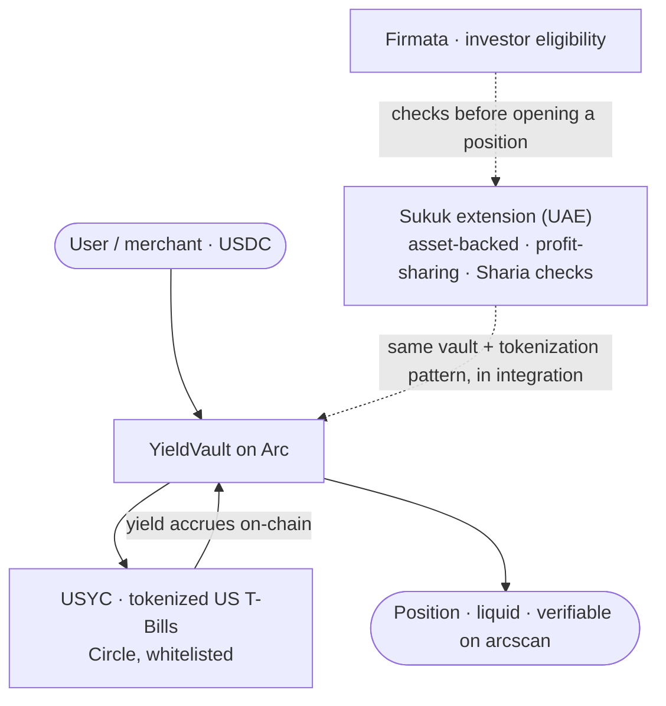

# Track 3 · RWA Tokenization

**Real-world yield, already on-chain. We run tokenized US Treasury Bill yield in production through Circle's USYC, and we are whitelisted to do it. The Sukuk piece is the Sharia-compliant extension for the UAE corridor.**

*Part of [Meridian × Ignyte](../README.md). For educational and testnet demo purposes only.*

**Demo:** the vault deposit video below. Site: https://themeridian.finance (the product pages are in private access for now).
**Track:** 3, RWA Tokenization
**Circle products used:** USDC · EURC · Circle Wallets · USYC (whitelisted, live)

---

## This is not a concept

Real-world asset tokenization is the topic everyone in this challenge will write about. Most teams can only write about it, because USYC is a gated Circle Enterprise product. Meridian holds the USYC Teller whitelist and has since 2025. So our RWA entry is the real product, running in production, not a mockup and not a slide.

## What we run

**YieldVault.** A merchant or a user deposits USDC on Arc and gets exposure to tokenized short-term US Treasuries through Circle's USYC. The yield comes from the T-Bills held inside USYC, it accrues on-chain, and it settles on Arc. There is no promised rate and no invented reward token. The vault holds a real-world asset in tokenized form and passes through what it earns, auditable at any moment. A depositor can withdraw at any time, and the position is verifiable on testnet.arcscan.app.

This matters beyond a savings feature. The primary user we build for is a merchant sitting on idle USDC float, the money that waits between an incoming payment and an outgoing one. Instead of that float sitting dead, it earns short-term Treasury yield on-chain, and it stays liquid. This is the treasury layer of the same connected stack that powers Track 1 payments and Track 4 agents.

## The Sukuk extension, for the UAE corridor

The same tokenization pattern applies to instruments the Gulf market actually uses. A Sukuk is asset-backed and shares profit rather than paying interest, which fits Sharia requirements where a conventional interest-bearing bond does not. Our extension wraps that structure with the compliance and investor checks a regulated market needs:

- fractional ownership of the underlying asset, tokenized on Arc,
- profit distribution programmed into the contract instead of a fixed coupon,
- investor eligibility and identity handled through Firmata before a position can be opened, so only verified, eligible investors take part.

This part is in integration for the UAE market. We are showing the architecture and the path here, built on the exact vault and tokenization primitives we already run in production with USYC. We are not claiming a live Sukuk, we are claiming a live RWA vault and an honest, buildable route to a Sharia-compliant version of it, from a team that already holds the enterprise access to do RWA properly.

## Why it fits Track 3

The track is RWA tokenization. We demonstrate it with a live Circle RWA product, USYC, that we are whitelisted to use, then show the Sukuk roadmap as the regional, Sharia-compliant version of the same machine. Real product first, regional extension second.

## How it works

## How we integrate Circle, product by product

- **USYC** is the tokenized RWA at the center of the vault, the real-world asset that produces the yield, held under our Teller whitelist. This is the piece most teams cannot access, and it is why our RWA flow uses the actual product.
- **USDC and EURC** are the deposit and settlement currencies, so a user can arrive in a stablecoin they already hold.
- **Circle Wallets** custody positions safely.
- Everything settles on **Arc**, gas paid in USDC, with the sub-second finality that makes deposit and withdrawal feel instant.

## What makes it defensible

Two things most entries will not have: a real Circle RWA product in production, not a slide, and the whitelist to run it. On top of that, a clear and honest path to a Sharia-compliant instrument for the UAE, built on primitives we already operate rather than a fresh idea drawn for the hackathon. The moat is access plus a working treasury engine, and a regional wedge (Sukuk) that maps onto a market where Sharia compliance is a requirement, not a preference.

## The numbers

- 19 contracts live on Arc Testnet (chain 5042002), verifiable on [testnet.arcscan.app](https://testnet.arcscan.app)
- 47,800+ on-chain transactions across the Meridian stack
- USYC Teller whitelist granted
- Building since day one of Testnet, October 28, 2025

## What is next

The USYC vault is live. The Sukuk extension is the next build: the asset-backing structure, the programmed profit distribution, and the investor-eligibility gate through Firmata, packaged for the UAE corridor. Same vault, same tokenization pattern, a Sharia-compliant wrapper on top.

## Proof it is live

**Watch a passkey login and a USYC vault deposit end to end:** https://youtu.be/9gvkIriycQU

19 contracts live on Arc Testnet (chain 5042002), addresses public on [testnet.arcscan.app](https://testnet.arcscan.app). The vault runs on Meridian's deployed contracts; the product page is in private access for now, open to the Circle and Arc team, with a new version moving from dev to production. Building since day one of Testnet, October 28, 2025.

## Circle product feedback

See [`../docs/circle-feedback.md`](../docs/circle-feedback.md) for our notes on USYC and the RWA stack.
