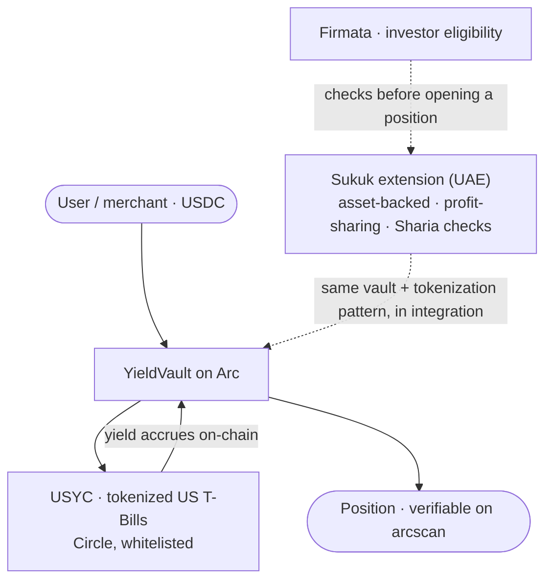

# Track 3 · RWA Tokenization

**Real-world yield, already on-chain. We run tokenized US Treasury Bill yield in production through Circle's USYC, and we are whitelisted to do it. The Sukuk piece is the Sharia-compliant extension for the UAE corridor.**

*Part of [Meridian × Ignyte](../README.md). For educational and testnet demo purposes only.*

**Live demo:** https://themeridian.finance (deposit into the YieldVault)
**Track:** 3, RWA Tokenization
**Circle products used:** USDC · EURC · Circle Wallets · USYC (whitelisted, live)

---

## This is not a concept

Most teams can only describe RWA tokenization in this challenge, because USYC is a gated Circle Enterprise product. Meridian holds the **USYC Teller whitelist** and has since 2025. So our RWA entry is the real product, running in production, not a mockup.

## What we run

**YieldVault.** A merchant or a user deposits USDC on Arc and gets exposure to tokenized short-term US Treasuries through Circle's USYC. The yield comes from the T-Bills held inside USYC, it accrues on-chain, and it settles on Arc. There is no promised rate and no invented reward token: the vault holds a real-world asset in tokenized form and passes through what it earns, auditable on-chain.

This is live. You can deposit in the vault on the site above, and the position is verifiable on testnet.arcscan.app.

## The Sukuk extension (UAE corridor)

The same tokenization pattern applies to instruments the Gulf market actually uses. A Sukuk is asset-backed and shares profit rather than paying interest, which fits Sharia requirements where a conventional bond does not. Our extension wraps that structure with the compliance and investor checks a regulated market needs:

- fractional ownership of the underlying asset, tokenized on Arc,
- profit distribution programmed into the contract instead of a fixed coupon,
- investor eligibility and identity handled through Firmata before a position can be opened.

This part is in integration for the UAE market. We are showing the architecture and the path, built on the same vault and tokenization primitives we already run with USYC.

## Why it fits Track 3

The track is RWA tokenization. We demonstrate it with a live Circle RWA product (USYC) that we are whitelisted to use, then show the Sukuk roadmap as the regional, Sharia-compliant version of the same machine. Real product first, extension second.

## How it works

## How we integrate Circle tools

- **USYC** is the tokenized RWA at the center of the vault, held under our Teller whitelist.
- **USDC and EURC** are the deposit and settlement currencies.
- **Circle Wallets** custody positions safely.
- Everything settles on **Arc**, gas paid in USDC.

## What makes it defensible

Two things most entries will not have: a real Circle RWA product in production (not a slide), and the whitelist to run it. On top of that, a clear and honest path to a Sharia-compliant instrument for the UAE, built on the primitives we already operate rather than a fresh idea drawn for the hackathon.

## Proof it is live

19 contracts live on Arc Testnet (chain 5042002), addresses public on [testnet.arcscan.app](https://testnet.arcscan.app). Building since day one of Testnet, October 28, 2025.

## Circle product feedback

See [`../docs/circle-feedback.md`](../docs/circle-feedback.md) for our notes on USYC and the RWA stack.
