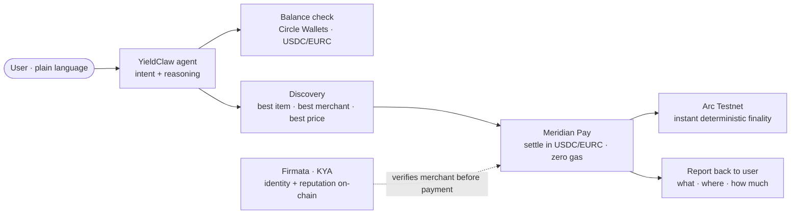
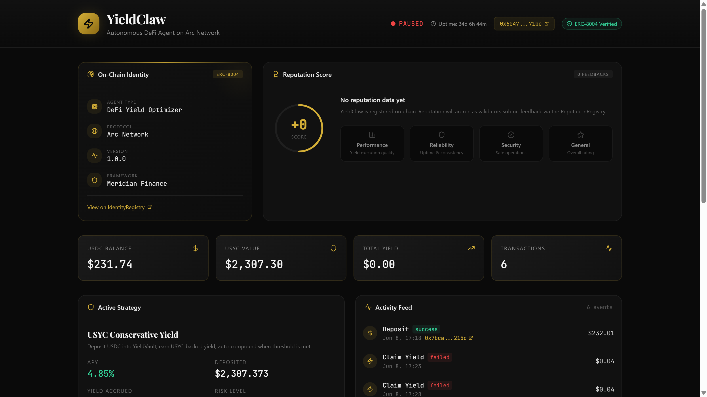
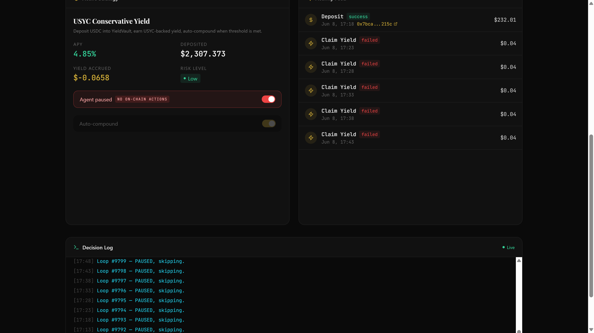

# Track 4: Agentic Economy · YieldClaw

**Talk to it like a person. It shops for you, pays in stablecoins, and reports back.**

*Part of [Meridian × Ignyte](../README.md). For educational and testnet demo purposes only.*

**Live agent activity feed:** https://arcagent.live
**Demo:** the agent screenshots and on-chain identity below, plus the overview video. The agent page itself is in private access for now, open to the Circle and Arc team.
**Track:** 4, Best Agentic Economy Experience on Arc
**Circle products used:** USDC · EURC · Circle Wallets · Nanopayments · Gateway

---

## What it is

**YieldClaw** is a live autonomous AI agent on Arc (ERC-8004 agent #262, previously shared by Jeremy Allaire, CEO of Circle). You give it a goal in plain language and it executes the whole transaction on your behalf:

> "Buy me a hoodie and a cap."
> "How much USDC do I have?"
> "Get me a sticker pack, cheapest option."

YieldClaw then:

1. **Understands** the request in natural language.
2. **Checks your balance** (USDC / EURC) on Arc.
3. **Finds the best option**, the right item, the best merchant, the lowest price.
4. **Funds if needed** and **pays the merchant** in USDC or EURC, with **zero gas** and **instant, deterministic settlement** on Arc.
5. **Verifies the counterparty** through Firmata before releasing payment, identity and reputation checked on-chain (Know Your Agent).
6. **Reports back** with a clear summary of what it bought, where, and for how much.

The same agent also runs **treasury operations autonomously**, the shopping flow is the demonstration for this track; the broader role is "give it a goal, the agent handles the rest."

## Why it fits Track 4

The track asks for *"an AI agent that autonomously discovers and executes a stablecoin-settled purchase using Arc smart contracts."* That is YieldClaw, **live today**, not a concept: a conversational agent that discovers the best option, settles in USDC/EURC at machine speed with no gas, and does it with on-chain trust verification built in. Most entries will demo an idea. This one is running at the URL above.

## How it works (architecture)

## How we integrate Circle tools

- **USDC & EURC**, the settlement rails. Every purchase is paid and settled in Circle stablecoins on Arc.
- **Circle Wallets**, secure key management so the agent can check balances and initiate payments on the user's behalf without exposing keys.
- **Nanopayments**, enables high-frequency, low-value, sub-cent agent payments at machine speed.
- **Gateway**, backend liquidity and routing for the payment flows the agent orchestrates.
- **Gas paid in USDC on Arc**, predictable, dollar-denominated cost; the user never touches a separate gas token.

> Production protocol source stays private. This folder documents the integration and the demo; the agent calls Meridian's already-deployed contracts on Arc (addresses public on testnet.arcscan.app). Firmata is referenced at the standard level (ERC-8004 identity + reputation); internal evaluator/SLA logic is not exposed.

## What makes this defensible

Anyone can wire an agent to a payment SDK. The hard part is **trust**: when an agent pays a merchant it has never met, who verifies the merchant is legitimate and the payment is warranted? YieldClaw answers that with Firmata, on-chain identity and reputation, checked before settlement. Payments settle; the trust layer decides who is allowed to be paid. That is the difference between an agent that *moves money* and an agent you can *let loose*.

## Proof it is live

The agent page, top and bottom:

The agent has a real on-chain identity. The AgentIdentity registry (ERC-8004) is live and public on Arc Testnet:

**AgentIdentity (ERC-8004):** [`0x8004A818BFB912233c491871b3d84c89A494BD9e`](https://testnet.arcscan.app/address/0x8004A818BFB912233c491871b3d84c89A494BD9e)

## Run it

The flows are shown in the screenshots above and the overview video. The live agent page is in private access for now, open to the Circle and Arc team. The production protocol source stays private. The demo calls Meridian's already-deployed contracts on Arc (addresses public on testnet.arcscan.app), and references Firmata at the standard level (ERC-8004 identity and reputation).

## Circle product feedback

See [`../docs/circle-feedback.md`](../docs/circle-feedback.md) for our notes on USDC, EURC, Circle Wallets, Nanopayments and Gateway in production.
